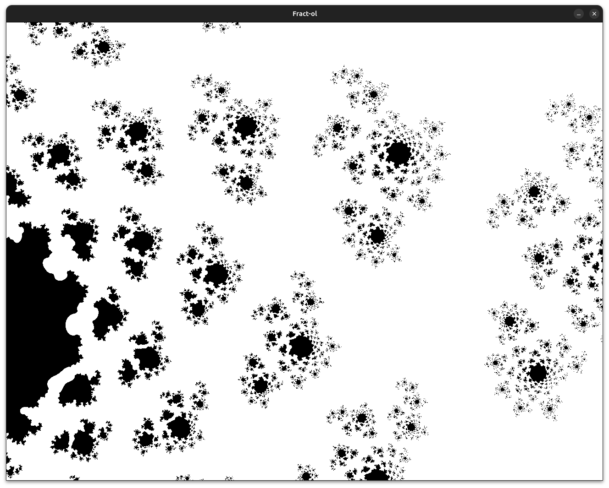
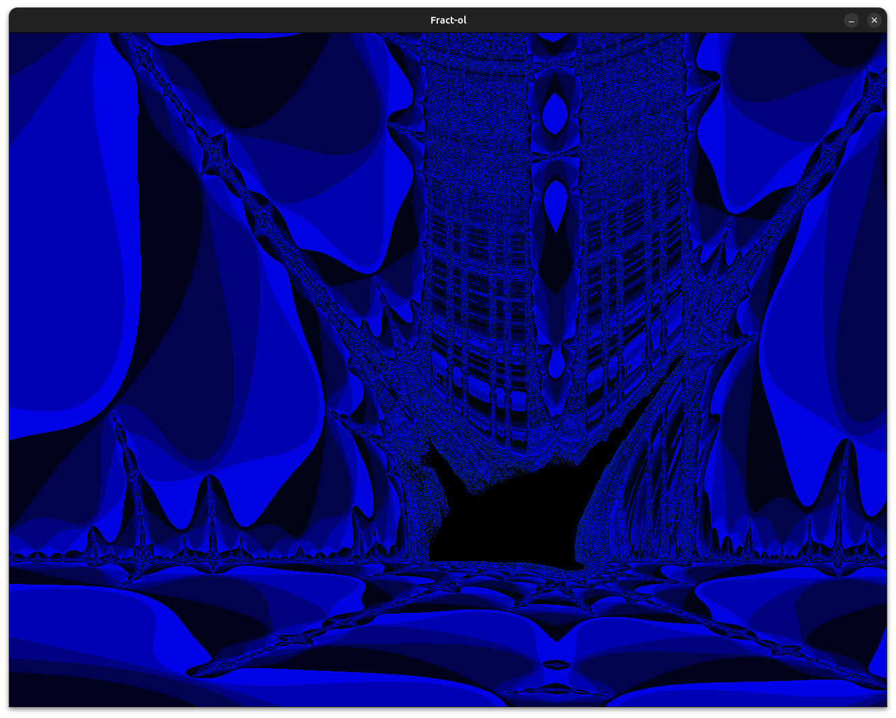
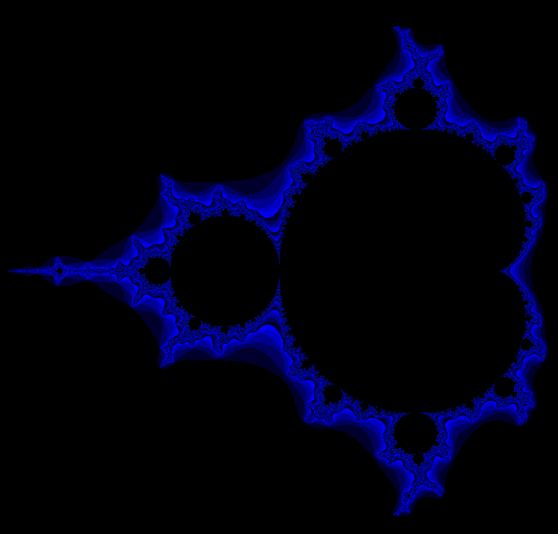
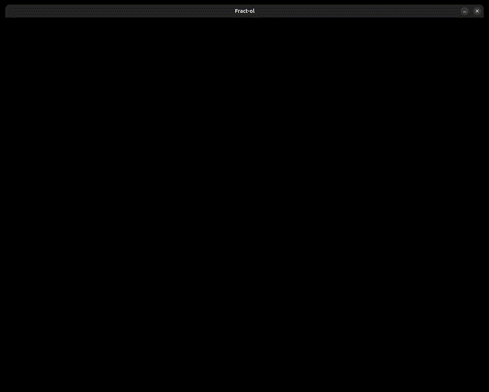

# Fract-ol 42 🌀
Welcome to my **Fract-ol 42 project**!  

# WHAT IS A FRACTAL?
In mathematics, a fractal is a geometric shape containing detailed structure at arb...
basically crazy math shi creating crazy visual shi

## Fract-ol 42 project
Fract-ol ->here add fractol description and project description (coding it..)
->here add project description (how to compile, run, ..)

