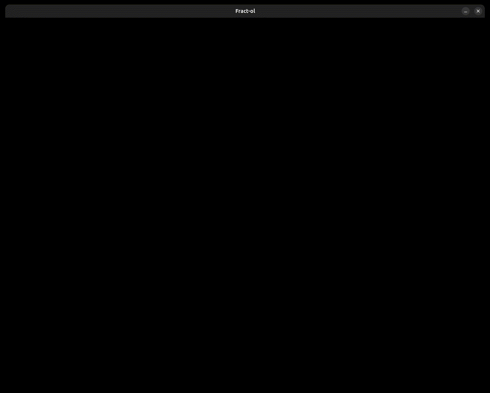

<!--  -->

WHAT IS A FRACTAL?
In mathematics, a fractal is a geometric shape containing detailed structure at arbi... basically crazy math shi creating cool visual shi

Fract-ol ->here add fractol description and project description (coding it..)

->here add project description (how to compile, run, ..)

->here add cool shit
<!--  -->

